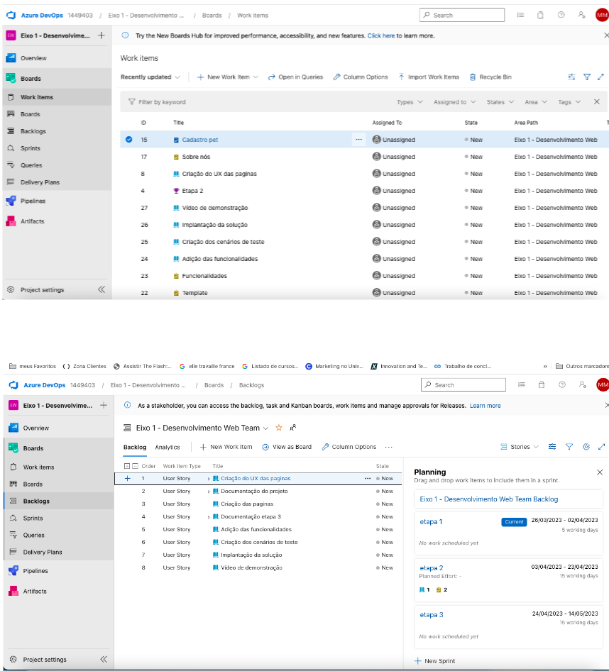

# Metodologia

Metodologia

A metodologia está estruturada na utilização de ferramentas no qual auxilia a equipe na manutenção de códigos e demais artefatos, para assim ter-se uma organização tanto no time quanto na execução de tarefas do projeto.  

Relação de Ambientes de Trabalho 

Os artefatos desse projeto estão a ser desenvolvidos a partir de diversas plataformas para facilitar o desenrolar do projeto. Abaixo observa-se uma tabela contendo as plataformas utilizadas:   

 
Relação de Ambientes de Trabalho 

Os artefatos desse projeto estão a ser desenvolvidos a partir de diversas plataformas para facilitar o desenrolar do projeto. Abaixo observa-se uma tabela contendo as plataformas utilizadas:   

* Repositório de código fonte: GitHub: https://github.com/guimaraesmthz/adoptionlove 
* Documentos do projeto: Microsoft Teams: https://sgapucminasbr.sharepoint.com/:f:/s/Grupo2-ProjetoDesenvolvimentoWEB/El0dGEwxwGtAtQAP7LYXiUsBoF7nIU0lGQM6Ba9vWHuJSA?e=Sdxbr1 
* Projeto de Interface e  Wireframes: Figma: https://www.figma.com/file/j8f1c93Odr0cVKPrZHeUSz/Projeto-Final?node-id=0%3A1&t=blsZrlSYQwIUruCI-1 
* Gerenciamento do Projeto:Azure DevOps: https://dev.azure.com/1449403/Eixo%201%20-%20Desenvolvimento%20Web 

### Divisão de Papéis

Gerenciamento do Projeto 

A equipe utiliza metodologias ágeis, tendo escolhido o Scrum como base para definição do processo de desenvolvimento. 

* A equipe está organizada da seguinte maneira: 

* Scrum Master: Adenilson Oliveira 

* Product Owner: Diogo Rafael 

* Equipe de Desenvolvimento: Ercules, Matheus Guimaraes  

* Equipe de Design: Matheus Amaral, Mayra Rodriguez 

O projeto apresenta uma organização e distribuição das tarefas, a equipe esta a utilizar a ferramenta Azure. para poder estruturar os seguintes itens da lista:  

Backlog: Tendo como objetivo receber s tarefas a serem apresentadas pelo Product Backlog. Contudo todas as atividades ou tarefas devem ser identificadas no decorrer do projeto devem ser transcritas a esta lista. 

To Do: É formulada uma lista para a representação do Sprint Backlog. Este é o Sprint atual que está a ser desenvolvido.  

Doing: Quando uma tarefa tiver sido iniciada, ela é movida para cá. 

Done: Nesta lista são apresentadas as tarefas que já passaram pelos testes e controles de qualidade e já se encontram prontos para serem entregues ao usuário. Não contendo mais edições ou revisões necessárias estão prontos a utilização  

O quadro kanban do grupo desenvolvido na ferramenta de gerenciamento de projetos está disponível através da URL xxxx e é apresentado, no estado atual, na Figura 1.  

