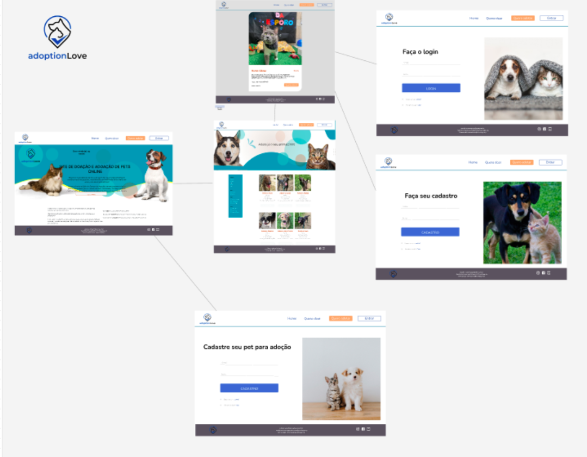
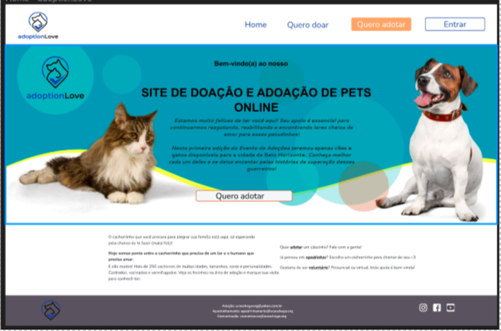
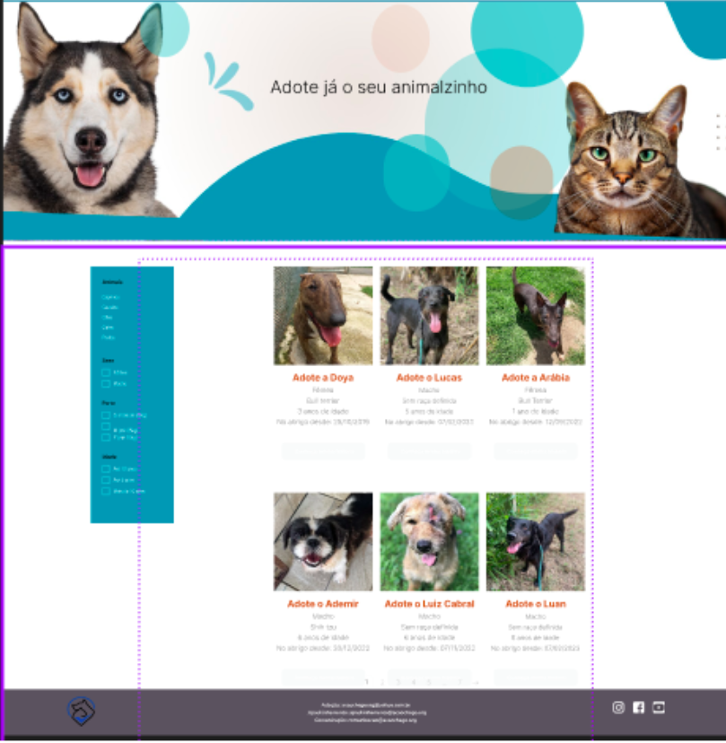
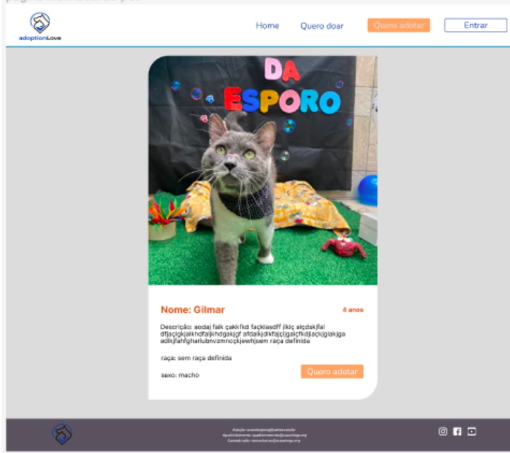
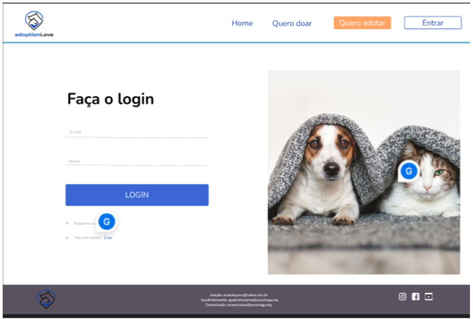
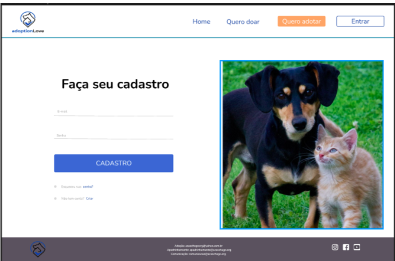
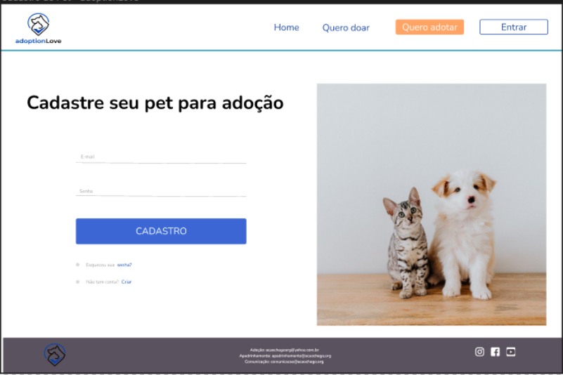

# Projeto de Interface

Projeto de Interface <a href="2-Especificação do Projeto.md"> Documentação de Especificação</a>

A princípio, o Projeto tem como escopos principais a celeridade de processamento e a praticidade de acesso. Tais pontos são essenciais para tornar a experiência do usuário a mais positiva possível. Por último, também é uma meta a responsividade do site com o intuito de estabelecer o acesso em mais de um tipo de dispositivo eletroeletrônico. 

O Diagrama abaixo na Figura 2 demonstra o fluxo de interação do usuário pelas telas do sistema. Cada tela deste fluxo será apresentada na seção de wireframes que segue abaixo. Disponibilizamos o link do site para visualização: 

.

## Wireframes
Tela – Home 

De acordo com o fluxo de telas do projeto apresentado anteriormente, as telas do sistema serão detalhadas nos itens subsequentes. As telas do sistema possuem uma estrutura comum, que é exemplificada na Figura 3. Essa estrutura consiste em três grandes blocos, que são descritos a seguir: 

* Cabeçalho: localizado no topo da tela, contém elementos fixos de identidade, como o logo, e a navegação principal do site, representada pelo menu da aplicação. 

* Conteúdo: área central da tela, onde o conteúdo específico é apresentado. 

* Barra inferior(rodapé/footer): localizada na margem inferior da tela, apresenta elementos de navegação secundária, geralmente relacionados aos elementos presentes no bloco de conteúdo. 

Tela – Quero adotar 

Nessa tela mostra os animais que tem a disposição para serem adotados, contendo fotos dos animais e suas descrições pode ser uma fonte valiosa de informações para as pessoas que estão interessadas em adotar. Além das imagens, a descrição de cada animal.Esses detalhes podem ajudar a entender melhor a vida desses animais, suas interações com outros seres vivos e como eles contribuem para o ecossistema como um todo que é exemplificada na Figura 4. Essa estrutura consiste em dois grandes blocos, que são descritos a seguir: 

* Barra lateral: Aonde é possível filtra as características dos animais que a pessoa deseja adotar. 

* Conteúdo: Aonde pode-se visualizar fotos dos animais e suas características, existindo uma barra de rolagem para facilitar a navegação do site.  

São protótipos usados em design de interface para sugerir a estrutura de um site web e seu relacionamentos entre suas páginas. Um wireframe web é uma ilustração semelhante do layout de elementos fundamentais na interface.

 

Tela – Detalhes do Pet 

Ao visualizar todos os animais a pessoa pode clicar para ver mais informações sobre o animal, que é exemplificada na Figura 5. Essa estrutura consiste em um pequeno bloco, que são descritos a seguir: 

* Conteúdo: Nessa parte ao clicar na figura do animal aparecerá uma foto maior do
 animal e e mais informações. 

Tela - Entrar / Login 

 

Cada pessoa que desejar adotar um pet para adoção deve ter um cadastro no site, sendo assim deverá ter o seu login, que é exemplificada na Figura 5. Essa estrutura consiste em um grande bloco, que são descritos a seguir: 

* Conteúdo: Nessa Parte será necessário que o usuário o seu login, caso ele não tenha o login ele será direcionado para a página de cadastro.  

Tela - Faça o seu cadastro 

Caso seja um novo usuário deve fazer o seu cadastro no site como é demostrado abaixo, que é exemplificada na Figura 6. Essa estrutura consiste em um grande bloco, que são descritos a seguir: 

* Conteúdo: Nessa Parte será necessário que o usuário crie o seu login, para poder ter acesso ao conteúdo detalhado da adoção do pet.

Tela – Cadastro do Pet 

Caso seja deseje colocar a disposição um pet  deve fazer o seu cadastro no site como é demostrado abaixo, que é exemplificada na Figura 7. Essa estrutura consiste em um grande bloco, que são descritos a seguir: 

* Conteúdo: Nessa Parte será necessário que o seu login que para poder entrar em uma parte especifica para cadastro de pet e gestão de pessoas interessadas, para poder ter acesso ao conteúdo detalhado da adoção do pet. 

