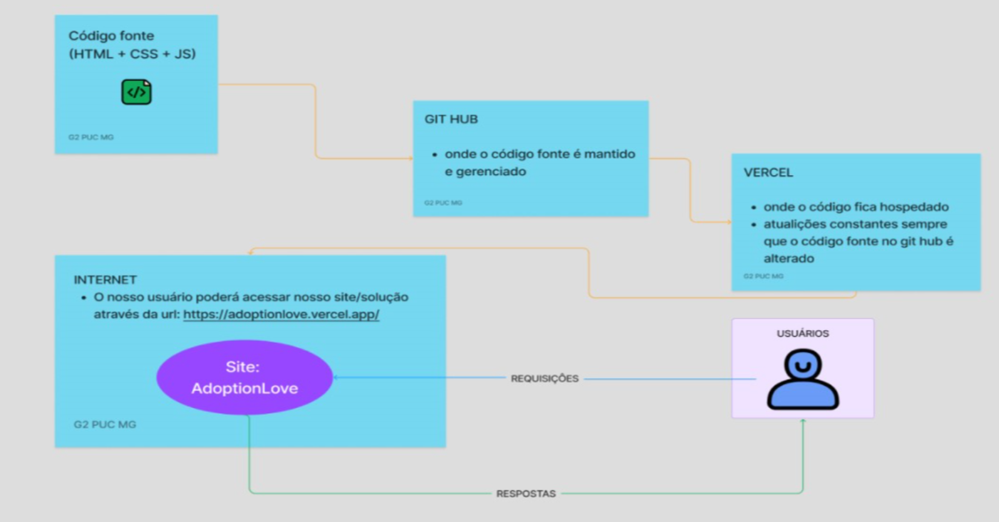

# Arquitetura da Solução

Arquitetura da Solução  <a href="3-Projeto de Interface.md"> Projeto de Interface</a>

Nesta seção, são descritos os aspetos técnicos da solução criada pela equipe, abrangendo os componentes integrantes e o ambiente de hospedagem utilizado. 

 
O diagrama de componentes ilustra os elementos que constituem a solução, conforme apresentado na Figura acima. A solução implementada inclui os seguintes módulos: 

Navegador: interface básica do sistema; 

Páginas Web: conjunto de arquivos HTML, CSS, JavaScript e imagens que contêm as funcionalidades do sistema; 

 

A hospedagem do site é realizada na plataforma do  Vercel, cuja URL de acesso é: 

https://adoptionlove.vercel.app 

O projeto é publicado no Vercel por meio de uma submissão via git para o repositório remoto disponível no endereço: 

https://adoptionlove.vercel.app 