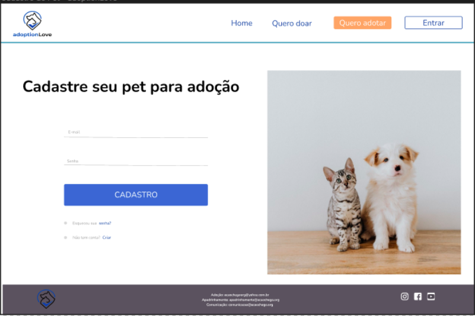
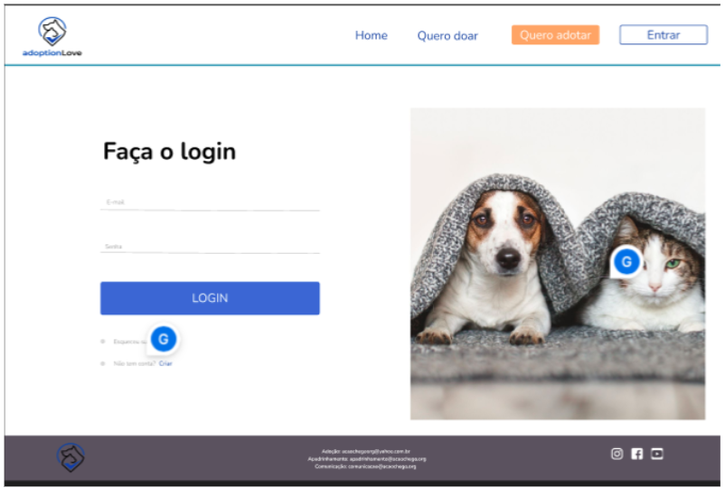

# Template padrão do site

Template do Site  <a href="2-Especificação do Projeto.md"> Especificação do Projeto</a>, <a href="3-Projeto de Interface.md"> Projeto de Interface</a>, <a href="4-Metodologia.md"> Metodologia</a>

Template do Site 

O site apresentará um layout que corresponde ao projeto de Interface, elaborado anteriormente como mostra a figura 8. 

>

O template do site está disponível em:  http://github.com/…..  e é composto pelos seguintes layouts:  

*Home 

*Quero doar 

*Quero Adotar 

*Login-Entrar 

*Cadastro 

A responsividade segue o padrão do Bootstrap 

Home 
 

Nessa pagina é possível ver as informações básicas e importantes para adotar um pet. 

Quero doar 

Este layout a pessoa será direcionado para uma página de cadastro do pet para disponibilizar para adoção. 

Quero Adotar 

Nessa parte aparecerá os pets disponíveis para adoção 

Login-Entrar ou Cadastro 

 

Nessa parte caso a pessoa deseje adotar um pet será necessário entrar no site e realizar um cadastro caso não possua: 

