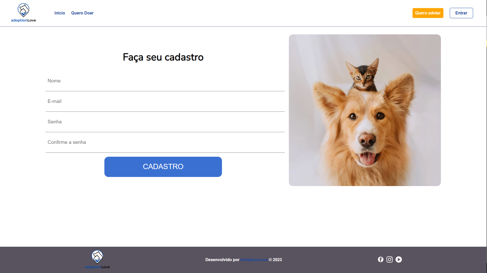
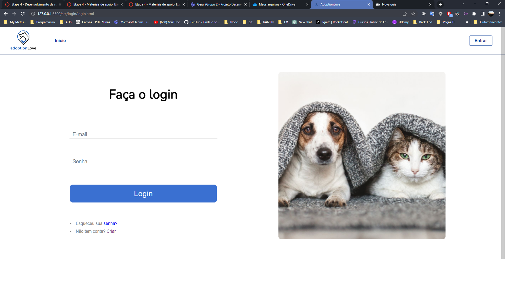
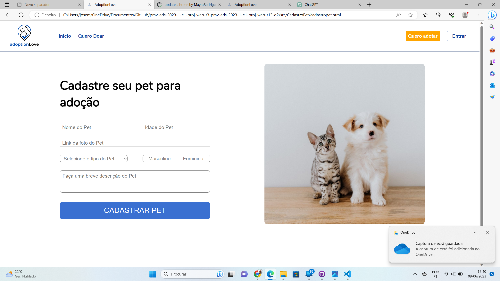
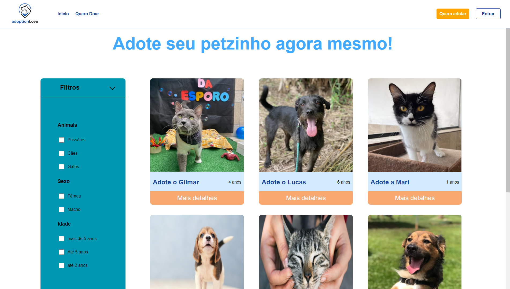
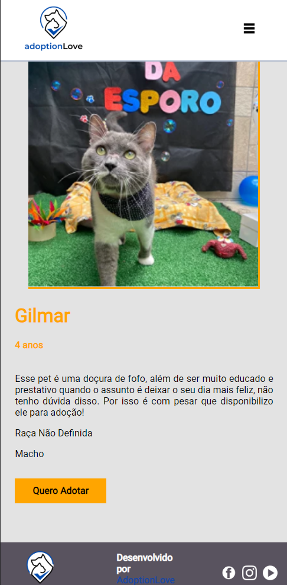

<!-- # Programação de Funcionalidades

Pré-requisitos: <a href="2-Especificação do Projeto.md"> Especificação do Projeto</a>, <a href="3-Projeto de Interface.md"> Projeto de Interface</a>, <a href="4-Metodologia.md"> Metodologia</a>, <a href="3-Projeto de Interface.md"> Projeto de Interface</a>, <a href="5-Arquitetura da Solução.md"> Arquitetura da Solução</a> -->
# Funcionalidades do Sistema (Telas)

Nesta seção são apresentadas as telas desenvolvidas para cada uma das funcionalidades do sistema. O respectivo endereço (URL) e outras orientações de acesso são apresentadas na sequência. 

## Home (Aprensentação do serviço) 

A tela principal do sistema apresenta todas as opções em que o usuário tem acesso e explica como funciona o processo de adoção. (RNF-01- RNF-02 - RNF-03 requisitos não funcionais) 

#### Requisitos atendidos 

* Apresentação do site para o usuário 

 

#### Artefatos da funcionalidade 

* home.html 

* stylehome.css 

*  global.css 

* imagemprincipal.jpg 

#### Instruções de acesso 

1. Abra um navegador de Internet e informe a seguinte URL: https://repl.it/Sf3l@#3ks (colocar nosso link da hospedagem) 

2. A tela home é a primeira funcionalidade(tela) exibida pela aplicação. 

## Tela de cadastro do usuário (RF-01 – RF 03- RNF-01) 

A tela de cadastro do usuário permite o usuário se registrar na aplicação e ter acesso as outras páginas e realizar outras ações que antes era não era permitido por precisarem de identificação do user. 

#### Artefatos da funcionalidade 

* cadastrocliente.html 

* script.js 

* styleCadastroCliente.css 

* love-bestfriends.jpg 

 

#### Instruções de acesso 

1. Faça o download do arquivo do projeto (ZIP) ou clone do projeto no GitHub; 

2. Descompacte o arquivo em uma pasta específica; 

3. Abra o Visual Studio Code e execute o Live Server; 

4. Abra um navegador de Internet e informe a seguinte URL: 
http://127.0.0.1:5500/src/CadastroCliente/cadastrocliente.html 

## Tela de login (RF-03) 

A tela de Login permite o usuário ter acesso as outras páginas e realizar outras ações que antes era não era permitido por precisarem de identificação do user. 

#### Artefatos da funcionalidade 

* login.html 

* login.css 

* loginscript.js 

* cat_and_dog_love.png 

 

#### Instruções de acesso 

1. Faça o download do arquivo do projeto (ZIP) ou clone do projeto no GitHub; 

2. Descompacte o arquivo em uma pasta específica; 

3. Abra o Visual Studio Code e execute o Live Server; 

4. Abra um navegador de Internet e informe a seguinte URL: 
http:// http://127.0.0.1:5500/src/login/login.html  

## Tela de cadastro do pet (RF-04) 

A tela de cadastro do usuário permite o usuário se registrar na aplicação e ter acesso as outras páginas e realizar outras ações que antes era não era permitido por precisarem de identificação do user. 

#### Artefatos da funcionalidade 

* cadastrocliente.html 

* script.js 

* styleCadastroCliente.css 

* love-bestfriends.jpg 

 

#### Instruções de acesso 

2. Faça o download do arquivo do projeto (ZIP) ou clone do projeto no GitHub; 

3. Descompacte o arquivo em uma pasta específica; 

4. Abra o Visual Studio Code e execute o Live Server; 

5. Abra um navegador de Internet e informe a seguinte URL: 
http://127.0.0.1:5500/src/CadastroCliente/cadastrocliente.html 

## Tela de adoção (RF-05) 

A tela de cadastro do usuário permite o usuário se registrar na aplicação e ter acesso as outras páginas e realizar outras ações que antes não era permitido por precisarem de identificação do user. 

#### Artefatos da funcionalidade 

* adotar.html 

* adotar.js 

* adotar.css 

* adota/img/*

 

#### Instruções de acesso 

1. Faça o download do arquivo do projeto (ZIP) ou clone do projeto no GitHub; 

2. Descompacte o arquivo em uma pasta específica; 

3. Abra o Visual Studio Code e execute o Live Server; 

4. Abra um navegador de Internet e informe a seguinte URL: 
http://127.0.0.1:5500/src/adotar/adotar.html 

## Tela do Pet (RF-06) 

A tela de cadastro do usuário permite o usuário se registrar na aplicação e ter acesso as outras páginas e realizar outras ações que antes era não era permitido por precisarem de identificação do user. 

#### Artefatos da funcionalidade 

* cadastrocliente.html 

* script.js 

* styleCadastroCliente.css 

* love-bestfriends.jpg 

 

#### Instruções de acesso 

1. Faça o download do arquivo do projeto (ZIP) ou clone do projeto no GitHub; 

2. Descompacte o arquivo em uma pasta específica; 

3. Abra o Visual Studio Code e execute o Live Server; 

4. Abra um navegador de Internet e informe a seguinte URL: 
http://127.0.0.1:5500/src/CadastroCliente/cadastrocliente.html 

<!-- Implementação do sistema descritas por meio dos requisitos funcionais e/ou não funcionais. Deve relacionar os requisitos atendidos os artefatos criados (código fonte) além das estruturas de dados utilizadas e as instruções para acesso e verificação da implementação que deve estar funcional no ambiente de hospedagem.

Para cada requisito funcional, pode ser entregue um artefato desse tipo -->

<!-- > **Links Úteis**:
>
> - [Trabalhando com HTML5 Local Storage e JSON](https://www.devmedia.com.br/trabalhando-com-html5-local-storage-e-json/29045)
> - [JSON Tutorial](https://www.w3resource.com/JSON)
> - [JSON Data Set Sample](https://opensource.adobe.com/Spry/samples/data_region/JSONDataSetSample.html)
> - [JSON - Introduction (W3Schools)](https://www.w3schools.com/js/js_json_intro.asp)
> - [JSON Tutorial (TutorialsPoint)](https://www.tutorialspoint.com/json/index.htm) -->