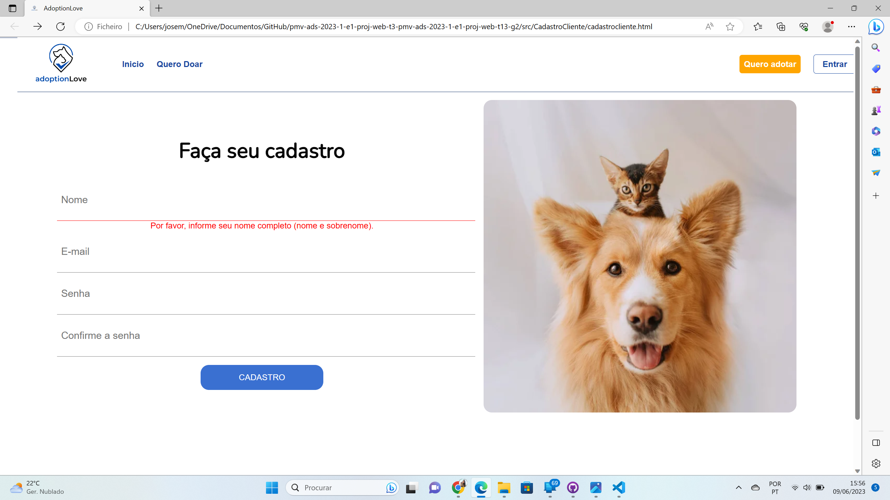
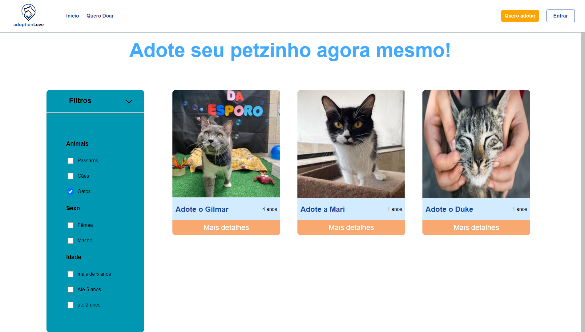
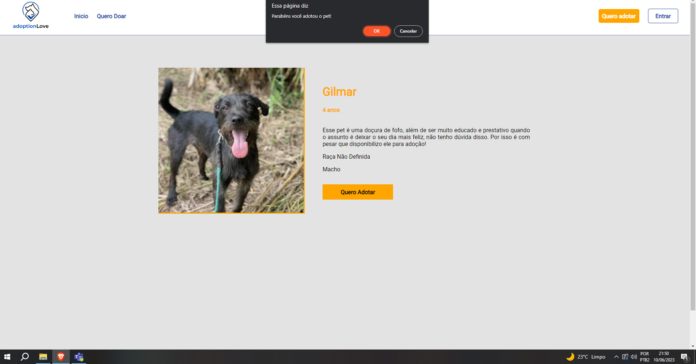
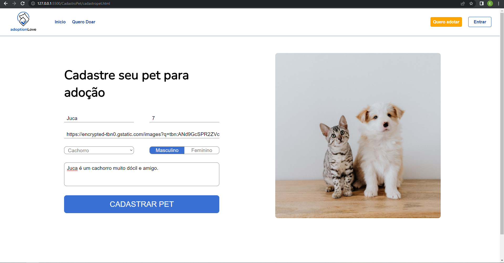

<!-- # Registro de Testes de Software

Pré-requisitos: <a href="3-Projeto de Interface.md"> Projeto de Interface</a>, <a href="8-Plano de Testes de Software.md"> Plano de Testes de Software</a> -->
<!-- 
Relatório com as evidências dos testes de software realizados no sistema pela equipe, baseado em um plano de testes pré-definido.

## Avaliação

Discorra sobre os resultados do teste. Ressaltando pontos fortes e fracos identificados na solução. Comente como o grupo pretende atacar esses pontos nas próximas iterações. Apresente as falhas detectadas e as melhorias geradas a partir dos resultados obtidos nos testes.

> **Links Úteis**:
> - [Ferramentas de Test para Java Script](https://geekflare.com/javascript-unit-testing/) -->

# Registro de Testes de Software

## Página Home - CT 01 

Nessa página podemos navegar e conhecer todo o site, os botões estão todos redirecionados para a navegação do site 

Abaixo podemos visualizar no teste o que acontece ao clicar em cada botão:  

Ao clicar no botão inicio o user permanece na mesma página:

Ao clicar no botão Quero doar o site direciona para essa página de cadastro do Pet 

Ao clicar no botão Quero adotar ou conheça nossos pets, o site direciona para a página de animais no qual o site já possui cadastro:

Ao clicar no botão Entrar , o site direciona para a página de login:

Quando a tela fica do tamanho de mobile o menu muda para melhor visualização :

## Página Cadastro do cliente - CT 02 

#### testes de navegação
Abaixo podemos visualizar no teste o que acontece ao clicar em cada botão:  

 
Ao clicar no botão inicio o usuário é redirecionado para a home:

Ao clicar no botão Quero doar o site direciona para essa página de cadastro do Pet 

Ao clicar no botão Quero adotar ou conheça nossos pets, o site direciona para a página de animais no qual o site já possui cadastro:

Ao clicar no botão Entrar , o site direciona para a página de login:

Quando a tela fica do tamanho de mobile o menu muda para melhor visualização :

#### testes funcionais

Para validar os dados do cadastro do cliente no primeiro campo é necessário que tenha nome e sobrenome. Caso não preencha nada aparece um erro. 

Caso preencha somente o primeiro nome ira aparecer um erro informando que deverá informar um sobrenome  

Apos ter preenchido nome e sobrenome é necessário informar um email, caso não preencha os dados e apresentando um erro, informando a obrigatoriedade de colocar o email.  

Ira aparece um erro caso o email não seja preenchido de forma correta. 

A senha deve conter no minino 8 dígitos caso não contenha ira aparece um erro.  

A senha deve ser igual, caso não seja aparece um erro, informando que a senha não coinside  

Caso todos os dados estejam corretos e demonstrado um pop-up informando que receberá um email para confirmação dos dados. 

## Página Adotar - CT 03 

Nessa página de adotar, se a pessoa estiver logada, é apresentada para a mesma todos os pets disponivéis para adoção. 

Se a pessoa clicar em algum filtro como por exemplo o de gatos, o site deverá filtrar todos os pets existente e mostrar apenas os pets do tipo gato para ela. Como mostrado na tela abaixo: 

## Página Login - CT 04 

Após  acessar a página de login 

Caso não seja preenchido o e-mail e senha e cliquado no botão “Login” será informado a mensagem “preencha seu e-mail" e “preencha sua senha” 

Caso informe e-mail invalido apresentará a mensagem “Formato de e-mail invalido” 

Caso informe a senha invalida apresentará a mensagem “A combinação de e-mail e senha está incorreta” 

Caso preencha o email e senha validos e previamente cadastrados 

Assim tendo acesso as funcionalidades da página adotar 

Ao clicar no botão “Esqueceu a sua senha?” será direcionado a Recuperar senha 

Ao clicar no botão “Não tem conta? Criar” será direcionado a página cadastro cliente 

Ao clicar no botão “Inicio” será direcionado a página Home 

Quando a tela fica do tamanho de mobile o menu muda para melhor visualização 

## Página do Pet - CT 05

Ao clickar no botão “Quero Adotar”, recebemos o retorno que adotamos o pet em questão. 

Após o evento do click em “Quero Adotar”, Aparecerá uma mensagem confirmando que o pet foi adotado 

## CT-06 - Cadastrar Pet – Cadastro de Pet 

1. Acessar a página home do site. 

2. Navegar até a seção "Cadastro Pet". 

3. Preencher todos os campos do formulário de cadastro do pet: nome, idade, tipo, link da foto, sexo e descrição. 

4. Clicar no botão "Cadastrar pet" e acesse a página adotar para confirmar

## CT-07- Cadastrar Pet – Campos não preenchidos 

1. Acessar a página home do site. 

2. Navegar até a seção "Cadastro Pet". 

3. Deixe em branco os campos obrigatórios do formulário de cadastro de pet: nome, idade, tipo, link da foto, sexo e descrição. 

4. Clicar no botão "Cadastrar pet". 

## CT-08 Cadastrar Pet – Campos preenchidos incorretamente 

1. Acessar a página home do site. 

2. Navegar até a seção "Cadastro Pet". 

3. Preencha todos os campos do formulário de cadastro do pet com informações inválidas, seguindo as restrições abaixo: 

* Nome: Digite um nome com menos de 3 caracteres. 

* Tipo: Não há restrições específicas. 

* Link: Digite um link que não siga o formato "https://(alguma coisa).com/(alguma coisa)". 

* Idade: Digite um valor menor que 0 ou maior que 30. 

* Sexo: Não há restrições específicas. 

* Descrição: Digite uma descrição com mais de 120 caracteres. 

4. Clicar no botão "Cadastrar pet". 

